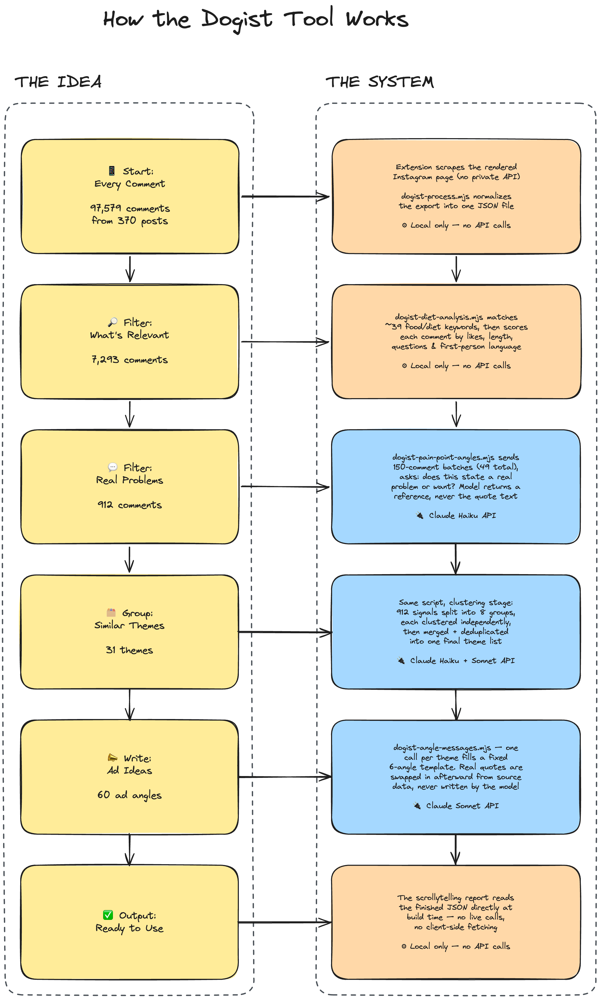

# Dogist Comment Intelligence

**Turning a 97,579-comment Instagram corpus into fully sourced ad angles — no quote ever generated, only ever looked up.**

[](https://dogist.vercel.app/audience-intelligence)
[](https://zquart8095.github.io/dogist-comment-intelligence/technical-design.html)


[](docs/media/how-it-works.png)

<sub>*Click to enlarge. The right-hand column follows one real comment — ♥42, from the actual corpus — all the way through to the ad copy it produced.*</sub>

## The problem

The Dogist (10M+ Instagram followers) was launching **Vitality Chew**, a blueberry-and-
pomegranate antioxidant dog supplement, and needed ad messaging grounded in what real dog
owners actually say about feeding their dogs — not invented supplement-brand copy. The brand's
own Instagram account held years of exactly that language, sitting unused in 97,579 comments
across 370 posts, with no existing way to turn that raw, unstructured history into usable
creative input at any reliable scale.

## What this is

A five-stage pipeline that collects, reduces, interprets, and packages Instagram comments into
ad angles a media buyer can actually spend against, read through a single scrollytelling report
(`/`) that walks section by section through the funnel, the ad-angle framework, and the results.

**The funnel:**

| Comments collected | Diet-relevant | Pain-point signals | Themes | Ad angles |
|---:|---:|---:|---:|---:|
| 97,579 | 7,293 | 912 | 31 | 60 |

Every quote in the report is looked up by a stable reference back to the original captured
comment — the model that writes an ad angle never has the text of the quote it's using, only a
pointer to it, so nothing downstream can paraphrase or fabricate one.

### Under the hood

Same five steps, mapped to what actually runs at each one — and, importantly, which steps call
the Claude API versus which are plain local computation:

[](docs/media/system-diagram.png)

### Why it's built this way

**📐 [Technical design document](https://zquart8095.github.io/dogist-comment-intelligence/technical-design.html)** — the
architecture, and the nine key design decisions with the trade-off behind each one: why DOM
scraping over API interception, why two unrelated clustering methods instead of one, why theme
clustering deliberately *stops* using embeddings, and how the no-fabricated-quotes guarantee is
enforced structurally rather than by asking the model nicely.

**📖 [Pipeline walkthrough](docs/comment-intelligence-pipeline.md)** — a narrative, stage-by-stage
read of how the corpus actually moves through the system.

## Stack

- **Next.js 16** (App Router) · React 19 · TypeScript — a single scrollytelling report, no
  client-side data fetching
- **Anthropic Claude** (`@anthropic-ai/sdk`) — Haiku 4.5 for high-volume extraction, Sonnet 4.6
  for theme deduplication and ad-angle writing
- **Python** (BERTopic, UMAP, HDBSCAN, sentence-transformers) for the independent embedding-based
  discovery pass
- A Chrome extension (vanilla JS, no build step) for corpus collection

## Local development

```bash
npm install
npm run dev   # http://localhost:3000
```

No secrets needed to view the report — it reads committed JSON. `ANTHROPIC_API_KEY` (via
`cp .env.example .env.local`) is only needed to re-run the Claude pipeline stages below.

## Tests

```bash
npm test            # self-contained unit tests — no local data needed
npm run test:corpus # integration tests against the full local corpus snapshot (see below)
```

## Regenerating the analysis

The report consumes the small JSON files in `data/opportunity-analysis/`,
produced from the corpus by:

```bash
npm run dogist:full   # analyze → event → discover → claude → diet → cultural → pain-points → angle-messages
```

Individual stages: `dogist:analyze`, `dogist:event`, `dogist:discover` (Python), `dogist:claude`,
`dogist:diet`, `dogist:cultural`, `dogist:pain-points`, `dogist:angle-messages`. The Claude/diet/
cultural/pain-point stages call the Anthropic API and load `.env.local`.

> **This repo ships the pipeline code and the small derived outputs it produces, not the raw
> scraped corpus.** The full comment-level export (real Instagram commenters' names and text,
> ~150MB) is real third-party personal data and is intentionally excluded — the pipeline scripts
> and `test:corpus` integration tests expect it locally under `data/processed/` but won't find it
> in a fresh clone of this repo. Everything the deployed report actually reads
> (`data/opportunity-analysis/pain-point-angles.json`, `angle-messages.json`) is committed and
> works out of the box.

## Data collection

`collector/` is the load-unpacked Chrome extension used to capture a corpus from
a logged-in Instagram session — DOM-based rather than API interception, with per-post capture-rate
telemetry and checkpointed state so a killed tab doesn't lose already-captured data. Operator
steps live in [`docs/blackhole-collector-runbook.md`](docs/blackhole-collector-runbook.md); process
a run export with `npm run collector:process -- --input <manifest.json>`.

## Project structure

```
collector/    Chrome extension — corpus collection
pipeline/     the pipeline: process → reduce → interpret → extract → angle-write
app/          the report route (app/page.tsx)
components/   the report's UI
product/      product brief + brand voice data the pipeline and report read
data/         committed pipeline outputs (raw corpus excluded, see above)
docs/         architecture, design decisions, and process docs
tests/        unit tests (self-contained) + corpus integration tests
```
